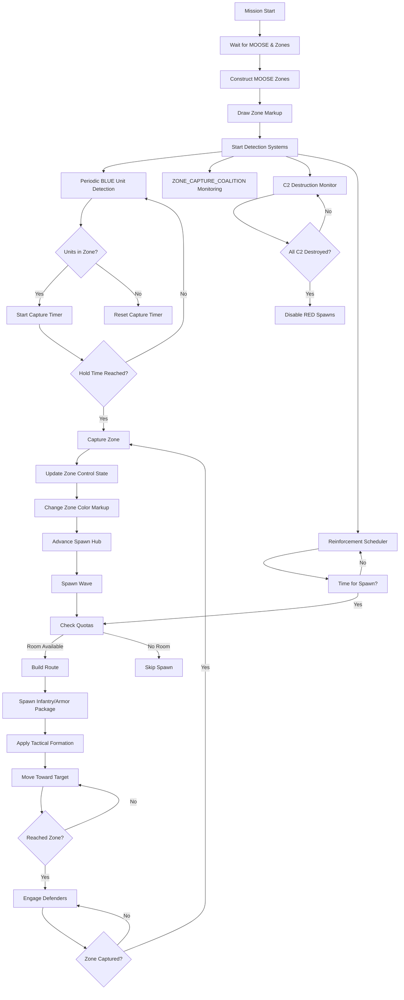

# MOOSE Zone Initializer

A robust, load-order safe mission scripting framework for DCS World that automates ground force spawning, zone capture detection, and dynamic battlefield management using the MOOSE framework.

## Overview

This script provides a comprehensive system for creating dynamic ground warfare scenarios in DCS Mission Editor. It handles:

- Automatic waiting for MOOSE core and Mission Editor zones to be available
- Construction of MOOSE ZONE objects for capture points (Alpha, Bravo, Charlie, Delta, Echo by default)
- Visual zone marking with smoke and drawing options
- Periodic BLUE unit detection over defined zones
- Dynamic spawning of BLUE and RED ground forces with waypoint routes
- Unit quota enforcement (limited numbers of each vehicle type alive at once)
- Sequential zone attack system (groups attack first uncaptured zone, then advance)
- Multiple route support with waypoint zones for varied attack paths
- Tactical formations (groups deploy into line abreast when approaching zones)
- Enemy C2 destruction system (destroying named static objects cuts off RED reinforcements)
- Automatic zone capture detection with FSM events (using ZONE_CAPTURE_COALITION when available)
- DCS Markup API zone coloring (zones change color on capture)
- Persistence: save/load zone state across server restarts
- Player Credits system: earn credits for kills, zone captures
- Integrated CTLD support for helicopter troop/cargo transport

## Features

### Core Systems
- **Zone Management**: Automatic detection and creation of MOOSE zones from Mission Editor trigger zones
- **Spawn Management**: Dynamic spawning of infantry, armor, and support vehicles with quota limits
- **Capture Detection**: Automatic zone capture detection using MOOSE ZONE_CAPTURE_COALITION (with fallback to legacy monitoring)
- **Visual Feedback**: Zone coloring via DCS Markup API (Foothold-style) with optional smoke drawing
- **Persistence**: Save/load mission state across server restarts
- **Credit System**: Foothold-inspired economy rewarding players for kills and captures

### AI Ground Forces
- **BLUE Forces**: US Marine Corps/Army units (M1 Abrams, M2 Bradley, M113, Stryker, etc.)
- **RED Forces**: Russian units (T-72B, BMP-2, BTR-80, etc.)
- **Quota System**: Limits on simultaneous unit types to prevent performance issues
- **Sequential Attack**: All groups focus on the first uncaptured zone before advancing
- **Multiple Routes**: Configurable waypoint zones for varied attack paths
- **Tactical Formations**: Units deploy into Rank formation when approaching targets
- **Dynamic Hub Advancement**: Capture zones move spawn points forward

### CTLD Integration
- Helicopter troop and vehicle transport capabilities
- Support for both MOOSE Ops.CTLD and ciribob CTLD implementations
- Configurable LOAD, DROP, and MOVE zones
- Support for modded helicopters with custom unit type capabilities
- Engineer and vehicle crate systems

## Mission Editor Setup

### Prerequisites
1. MOOSE framework must be loaded before this script
2. MIST framework is recommended but not required
3. Create the following trigger zones in the Mission Editor:

### Required Zones
- **Capture Zones** (exact names required): `Alpha`, `Bravo`, `Charlie`, `Delta`, `Echo`
- **Spawn Zones** (configure in CONFIG.spawnZones):
  - `groundSpawnN` (North/BLUE starting spawn)
  - `groundSpawnM` (Middle/BLUE forward spawn)
  - `groundSpawnS` (South/BLUE advanced spawn)
  - `redSpawnE` (East/RED starting spawn)
  - `redSpawnM` (Middle/RED forward spawn)
- **Waypoint Zones** (optional, for multiple routes):
  - `wpBN1`, `wpBN2` (BLUE northern route)
  - `wpBS1`, `wpBS2` (BLUE southern route)
  - `wpRN1`, `wpRN2` (RED northern route)
  - `wpRS1`, `wpRS2` (RED southern route)
- **CTLD Zones** (if CTLD enabled):
  - LOAD zones: `CTLDLoad_North`, `CTLDLoad_South`
  - DROP zones: `CTLDDrop_Alpha`, `CTLDDrop_Bravo`
  - MOVE zones: Reuses capture zones (`Alpha` through `Echo`)
- **C2 Static Objects** (if C2 destruction enabled):
  - `enemyc2-1`, `enemyc2-2` (RED command and control structures)

### Trigger Configuration
1. **MISSION START Trigger**
   - Action: DO SCRIPT FILE -> `Moose.lua` (load MOOSE core)

  2. **TIME MORE Trigger** (1 second delay)
    - Action: DO SCRIPT FILE -> `scripts/moose_zone_init.lua` (this file)

## Configuration Options

All configuration is done in the `CONFIG` table at the top of the script. Key sections include:

### Basic Settings
- `zoneNames`: List of capture zone names (default: `{"Alpha", "Bravo", "Charlie", "Delta", "Echo"}`)
- `coalitionFilter`: Which coalition to detect (`"blue"` or `"red"`)
- `smokeZones`: Enable native DCS smoke on zones
- `drawZones`: Enable MOOSE DrawZone visualization
- `useMarkupDraw`: Use DCS Markup API for persistent zone coloring (recommended)
- `zoneColors`: Colors for zone markup (red, blue, neutral)

### Spawn Settings
- `enableSpawnManager`: Toggle dynamic spawning
- `spawnZones`: Defines BLUE spawn hub zone names
- `redSpawnHubs`: Defines RED spawn hub zone names
- `spawnInterval`: Seconds between spawn waves (default: 300)
- `spawnOnStart`: Spawn initial wave at mission start
- `spawnAlternating`: Alternate between infantry and armor waves
- `blueQuota`/`redQuota`: Maximum alive units per type (MBT, IFV, APC)

### Route Settings
- `blueAdvanceRoute`/`redAdvanceRoute`: Ordered list of zones to capture
- `blueHubAdvance`/`redHubAdvance`: How capturing zones moves spawn hubs
- `blueRoutes`/`redRoutes`: Alternative waypoint routes for varied attacks
- `tacticalFormation`: Formation to use near targets (`"Rank"`, `"Vee"`, etc.)
- `tacticalApproachDist`: Distance to deploy formation (meters)
- `transitSpeed`/`tacticalApproachSpeed`: Movement speeds (m/s)

### CTLD Settings
- `enableCTLD`: Enable helicopter transport system
- `ctldHeloPrefixes`: Group name prefixes for CTLD helicopters
- `ctldLoadZones`/`ctldDropZones`/`ctldMoveZones`: Trigger zone names for CTLD operations
- `ctldTroops`/`ctldVehicleCrates`/`ctldEngineers`: Cargo definitions
- `ctldExtraUnitCaps`: Capabilities for modded helicopters

### Advanced Features
- `enablePersistence`: Save/load state across restarts
- `enableCredits`: Player credit/reward system
- `redC2StaticNames`: List of RED C2 objects that disable reinforcements when destroyed
- `useCaptureCoalition`: Use MOOSE ZONE_CAPTURE_COALITION for capture detection
- `initialZoneSides`: Starting ownership of zones (1=RED, 2=BLUE, 0=NEUTRAL)

## Dependencies

- **MOOSE Framework**: Required (must be loaded before this script)
- **MIST Framework**: Recommended but not required
- **CTLD**: Either MOOSE Ops.CTLD or ciribob CTLD (if CTLD features enabled)
- **DCS World**: 2.5 or later (Markup API requires 2.8+ for full features)

## How It Works

1. **Initialization**: Script waits for MOOSE core and Mission Editor zones to be available
2. **Zone Construction**: Creates MOOSE ZONE objects from trigger zones
3. **Visual Setup**: Draws zone markings using DCS Markup API (or MOOSE DrawZone as fallback)
4. **Detection Systems**: 
   - Starts periodic BLUE unit detection in zones
   - Initializes ZONE_CAPTURE_COALITION for automatic capture detection
   - Sets up C2 destruction monitoring (if enabled)
   - Starts periodic reinforcement schedulers
5. **Dynamic Spawning**:
   - Checks quotas before spawning
   - Cycles through infantry/armor packages
   - Uses waypoint routes with tactical approach waypoints
   - Advances spawn hubs when zones are captured
6. **Capture Handling**:
   - Updates zone control state
   - Changes zone colors via markup API
   - Awards capture credits to nearby players
   - Triggers hub advancement and spawn waves
   - Saves state if persistence enabled
7. **CTLD Integration** (if enabled):
   - Registers helicopter unit types
   - Configures LOAD/DROP/MOVE zones
   - Adds troop, engineer, and vehicle cargo
   - Handles CTLD events (troop deployments, crate builds, etc.)

## Workflow Diagram

## Customization

### Adding New Zone Types
1. Add zone names to `CONFIG.zoneNames`
2. Create corresponding trigger zones in Mission Editor
3. Add to `CONFIG.blueAdvanceRoute` and/or `CONFIG.redAdvanceRoute` as needed
4. Add hub advancement rules to `CONFIG.blueHubAdvance`/`CONFIG.redHubAdvance` if capturing should move spawn points

### Modifying Force Composition
- Edit `spawnInfantryPackage()` and `spawnArmorPackage()` functions
- Adjust unit types and quantities in the spawn functions
- Modify quota categories in `BLUE_TYPE_CLASS`/`RED_TYPE_CLASS` tables
- Adjust quota limits in `blueQuota`/`redQuota` tables

### Changing Visual Appearance
- Modify `CONFIG.zoneColors` for different zone colors
- Adjust `CONFIG.drawLineColor`, `CONFIG.drawFillColor`, `CONFIG.drawLineWidth`
- Change `CONFIG.smokeColor` for different smoke colors
- Toggle `CONFIG.useMarkupDraw` between Markup API and MOOSE DrawZone

## Credits

This script is inspired by and builds upon concepts from:
- FOOTHOLD framework
- MOOSE framework
- Various DCS community mission scripts

## License

This script is provided as-is for use in DCS World missions. Feel free to modify and adapt for your own missions.

---
*README generated for moose_zone_init.lua*