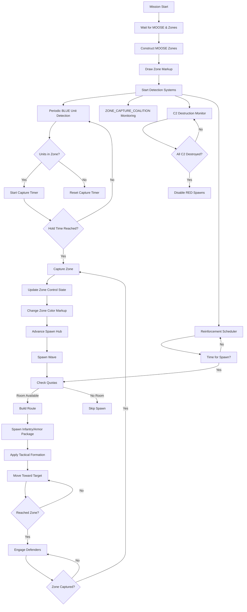

# Bullet's Ground Ops

A plug-and-play ground warfare scripting framework for DCS World that automates ground force spawning, zone capture detection, and dynamic battlefield management. Designed for easy integration into DCS missions with CTLD support, using MOOSE and optionally MIST as external dependencies.

## Overview

This script provides a comprehensive system for creating dynamic ground warfare scenarios in the DCS Mission Editor. It handles:

- Automatic waiting for MOOSE core and Mission Editor zones to be available
- Construction of MOOSE ZONE objects for capture points (Alpha, Bravo, Charlie, Delta, Echo by default)
- Visual zone marking with DCS Markup API coloring and optional smoke
- Periodic BLUE unit detection over defined zones
- Dynamic spawning of BLUE and RED ground forces with waypoint routes
- Unit quota enforcement (limited numbers of each vehicle type alive at once)
- Sequential zone attack system (groups attack first uncaptured zone, then advance)
- Multiple route support with waypoint zones for varied attack paths
- Tactical formations (groups deploy into line abreast when approaching zones)
- Enemy C2 destruction system (destroying named static objects cuts off RED reinforcements)
- Automatic zone capture detection with FSM events (using ZONE_CAPTURE_COALITION when available)
- DCS Markup API zone coloring (zones change color on capture)
- Persistence: save/load zone state across server restarts
- Player Credits system: earn credits for kills, zone captures
- Optional CTLD integration for helicopter troop/cargo transport

## Features

### Core Systems
- **Zone Management**: Automatic detection and creation of MOOSE zones from Mission Editor trigger zones
- **Spawn Management**: Dynamic spawning of infantry, armor, and support vehicles with quota limits
- **Capture Detection**: Automatic zone capture detection using MOOSE ZONE_CAPTURE_COALITION (with fallback to legacy monitoring)
- **Visual Feedback**: Zone coloring via DCS Markup API (Foothold-style) with optional smoke drawing
- **Persistence**: Save/load mission state across server restarts
- **Credit System**: Foothold-inspired economy rewarding players for kills and captures

### AI Ground Forces
- **BLUE Forces**: US Marine Corps/Army units (M1 Abrams, M2 Bradley, M113, Stryker, M48 Chaparral, HMMWV TOW, Gepard)
- **RED Forces**: Russian units (T-72B, BMP-2, BTR-80, ZSU-23-4 Shilka, SA-9 Strela)
- **Quota System**: Limits on simultaneous unit types (MBT, IFV, APC) to prevent performance issues
- **Sequential Attack**: All groups focus on the first uncaptured zone before advancing
- **Multiple Routes**: Configurable waypoint zones for varied attack paths
- **Tactical Formations**: Units deploy into Rank formation when approaching targets
- **Dynamic Hub Advancement**: Capture zones move spawn points forward

### CTLD Integration (Optional)
- Helicopter troop and vehicle transport capabilities
- Support for both MOOSE Ops.CTLD and ciribob CTLD implementations
- Configurable LOAD, DROP, and MOVE zones
- Support for modded helicopters (UH-60L, CH-47F, C-130, Hercules) with custom unit type capabilities
- Engineer and vehicle crate systems
- FARP crate deployment

## Files in This Repository

| File | Description |
|------|-------------|
| `scripts/bullets_ground_ops_V09B.lua` | Main ground ops script — handles zone management, spawning, capture detection, CTLD, persistence, and credits |
| `scripts/bullets_ground_ops_diagnostic.lua` | Diagnostic/troubleshooting script — verifies MOOSE availability, checks ME trigger zones, and reports status |

## Prerequisites (External Dependencies)

These frameworks are **not included** in this repository. You must obtain and load them separately in your DCS mission.

| Dependency | Required? | Notes |
|------------|-----------|-------|
| **MOOSE Framework** | **Required** | Must be loaded before this script. Provides ZONE, SET_GROUP, SCHEDULER, ZONE_CAPTURE_COALITION, and other core classes. Download from [MOOSE GitHub](https://github.com/FlightControl-Master/MOOSE). |
| **MIST Framework** | Recommended | Not a hard dependency, but recommended for broader scripting compatibility. |
| **CTLD** | Optional | Either MOOSE Ops.CTLD or ciribob standalone CTLD. Only needed if `CONFIG.enableCTLD = true`. |
| **DCS World** | **Required** | 2.5 or later. Markup API features (zone coloring) require DCS 2.8+. |

## Mission Editor Setup

### Required Zones

Create the following trigger zones in the Mission Editor:

- **Capture Zones** (exact names required): `Alpha`, `Bravo`, `Charlie`, `Delta`, `Echo`
- **BLUE Spawn Zones** (configure in `CONFIG.spawnZones`):
  - `groundSpawnN` — North / BLUE starting spawn
  - `groundSpawnM` — Middle / BLUE forward spawn
  - `groundSpawnS` — South / BLUE advanced spawn
- **RED Spawn Zones** (configure in `CONFIG.redSpawnHubs`):
  - `redSpawnE` — East / RED starting spawn
  - `redSpawnM` — Middle / RED forward spawn
- **Waypoint Zones** (optional, for multiple routes):
  - `wpBN1`, `wpBN2` — BLUE northern route
  - `wpBS1`, `wpBS2` — BLUE southern route
  - `wpRN1`, `wpRN2` — RED northern route
  - `wpRS1`, `wpRS2` — RED southern route
- **CTLD Zones** (if CTLD enabled):
  - LOAD zones: `CTLDLoad_North`, `CTLDLoad_South`
  - DROP zones: `CTLDDrop_Alpha`, `CTLDDrop_Bravo`
  - MOVE zones: Reuses capture zones (`Alpha` through `Echo`)
- **C2 Static Objects** (if C2 destruction enabled):
  - `enemyc2-1`, `enemyc2-2` — RED command and control structures (static objects)

### CTLD Template Groups (if CTLD enabled)

Create these as **late-activated** BLUE groups in the Mission Editor:

| Template Group Name | Contents |
|---------------------|----------|
| `CTLD_INF_RIFLE` | 8-man rifle squad (Soldier M4 x6, Soldier M249 x1, Soldier RPG x1) |
| `CTLD_INF_AT` | 4-man AT team (Soldier RPG x4) |
| `CTLD_INF_AA` | 2-man AA team (e.g. Stinger MANPADS) |
| `CTLD_VEH_HUMVEE` | HMMWV TOW |
| `CTLD_VEH_STRYKER` | M1126 Stryker ICV |
| `CTLD_VEH_BRADLEY` | M-2 Bradley |
| `CTLD_ENGINEERS` | 2-man engineer team (for building crates) |
| `CTLD_FARP_CRATE` | FARP crate |

### Trigger Configuration

1. **MISSION START Trigger**
   - Action: DO SCRIPT FILE → Load your `Moose.lua` (MOOSE core library)

2. **TIME MORE Trigger** (1 second delay)
   - Action: DO SCRIPT FILE → `scripts/bullets_ground_ops_V09B.lua`

3. *(Optional)* **TIME MORE Trigger** (1 second delay)
   - Action: DO SCRIPT FILE → `scripts/bullets_ground_ops_diagnostic.lua` (for troubleshooting)

## Configuration Options

All configuration is done in the `CONFIG` table at the top of `scripts/bullets_ground_ops_V09B.lua`. Key sections include:

### Basic Settings
- `zoneNames`: List of capture zone names (default: `{"Alpha", "Bravo", "Charlie", "Delta", "Echo"}`)
- `coalitionFilter`: Which coalition to detect (`"blue"` or `"red"`)
- `smokeZones`: Enable native DCS smoke on zones
- `drawZones`: Enable MOOSE DrawZone visualization
- `useMarkupDraw`: Use DCS Markup API for persistent zone coloring (recommended)
- `zoneColors`: Colors for zone markup (red, blue, neutral)

### Spawn Settings
- `enableSpawnManager`: Toggle dynamic spawning
- `spawnZones`: Defines BLUE spawn hub zone names
- `redSpawnHubs`: Defines RED spawn hub zone names
- `spawnInterval`: Seconds between spawn waves (default: 300)
- `spawnOnStart`: Spawn initial wave at mission start
- `spawnAlternating`: Alternate between infantry and armor waves
- `blueQuota`/`redQuota`: Maximum alive units per type (MBT, IFV, APC)
- `spawnCooldown`: Minimum seconds between spawn waves (default: 15)
- `useUSAForBlue`: Use USA country ID for BLUE forces (vs CJTF_BLUE)

### Route Settings
- `blueAdvanceRoute`/`redAdvanceRoute`: Ordered list of zones to capture
- `blueHubAdvance`/`redHubAdvance`: How capturing zones moves spawn hubs
- `blueRoutes`/`redRoutes`: Alternative waypoint routes for varied attacks
- `tacticalFormation`: Formation to use near targets (`"Rank"`, `"Vee"`, etc.)
- `tacticalApproachDist`: Distance to deploy formation (meters, default: 800)
- `transitSpeed`/`tacticalApproachSpeed`: Movement speeds (m/s)

### CTLD Settings
- `enableCTLD`: Enable helicopter transport system
- `ctldHeloPrefixes`: Group name prefixes for CTLD helicopters (case-sensitive)
- `ctldLoadZones`/`ctldDropZones`/`ctldMoveZones`: Trigger zone names for CTLD operations
- `ctldTroops`/`ctldVehicleCrates`/`ctldEngineers`/`ctldFarpCrates`: Cargo definitions
- `ctldExtraUnitCaps`: Capabilities for modded helicopters
- `ctldUseOwnPilotSet`: Bypass category filter for modded helos (recommended: `true`)
- `ctldPatchLogging`: Patch ciribob CTLD's `ctld.p()` at runtime to prevent circular-reference crashes (default: `true`)
- `ctldMaxLogDepth`: Max table nesting depth for `ctld.p()` serialization (default: `10`)
- `ctldSuppressInfoLogs`: Suppress `ctld.logInfo()` messages to reduce log volume; errors/warnings always kept (default: `false`)

### Advanced Features
- `enablePersistence`: Save/load state across restarts (requires `lfs` + `io` in DCS env)
- `enableCredits`: Player credit/reward system
- `redC2StaticNames`: List of RED C2 objects that disable reinforcements when destroyed
- `useCaptureCoalition`: Use MOOSE ZONE_CAPTURE_COALITION for capture detection
- `initialZoneSides`: Starting ownership of zones (1=RED, 2=BLUE, 0=NEUTRAL)
- `testMode`: Enable verbose diagnostic output and faster timers

## How It Works

1. **Initialization**: Script waits for MOOSE core and Mission Editor zones to be available (self-defers with `timer.scheduleFunction`)
2. **Zone Construction**: Creates MOOSE ZONE objects from trigger zones
3. **Visual Setup**: Draws zone markings using DCS Markup API (or MOOSE DrawZone as fallback)
4. **Detection Systems**: 
   - Starts periodic BLUE unit detection in zones
   - Initializes ZONE_CAPTURE_COALITION for automatic capture detection (or falls back to legacy SCHEDULER-based polling)
   - Sets up C2 destruction monitoring (if enabled)
   - Starts periodic reinforcement schedulers
5. **Dynamic Spawning**:
   - Checks quotas before spawning (per-type MBT/IFV/APC limits)
   - Cycles through infantry/armor packages (alternating waves)
   - Uses waypoint routes with tactical approach waypoints
   - Advances spawn hubs when zones are captured
6. **Capture Handling**:
   - Updates zone control state
   - Changes zone colors via markup API
   - Awards capture credits to nearby players (if credits enabled)
   - Triggers hub advancement and spawn waves
   - Saves state if persistence enabled
7. **CTLD Integration** (if enabled):
   - Detects available CTLD implementation (MOOSE Ops.CTLD or ciribob)
   - Registers helicopter unit types and modded helo capabilities
   - Configures LOAD/DROP/MOVE zones
   - Adds troop, engineer, vehicle, and FARP cargo
   - Handles CTLD events (troop deployments, crate builds, pickups)

## Workflow Diagram

## Diagnostics

The `scripts/bullets_ground_ops_diagnostic.lua` script is a standalone troubleshooting tool that can be loaded alongside or instead of the main script. It:

1. Prints clear on-screen + log messages confirming execution (prefixed with `[MZ-DIAG]`)
2. Detects whether MOOSE core classes (ZONE, MESSAGE, SCHEDULER, BASE, SET_UNIT) are available
3. Verifies Mission Editor trigger zones named Alpha through Echo exist
4. Optionally smokes each found zone center for visual confirmation (set `MZ_ENABLE_DIAG_SMOKE = true`)
5. If MOOSE is present: builds ZONE objects, attempts MOOSE smoke/draw, and sets up a basic BLUE detection scheduler
6. If MOOSE is not present at load time: periodically re-checks for ~30 seconds and reports when detected

All diagnostic messages are prefixed with `[MZ-DIAG]` in both on-screen text and `dcs.log`.

## Customization

### Adding New Zone Types
1. Add zone names to `CONFIG.zoneNames`
2. Create corresponding trigger zones in Mission Editor
3. Add to `CONFIG.blueAdvanceRoute` and/or `CONFIG.redAdvanceRoute` as needed
4. Add hub advancement rules to `CONFIG.blueHubAdvance`/`CONFIG.redHubAdvance` if capturing should move spawn points
5. Update `CONFIG.initialZoneSides` with the starting ownership

### Modifying Force Composition
- Edit `spawnInfantryPackage()` and `spawnArmorPackage()` functions for BLUE forces
- Edit `spawnRedWaveA()` and `spawnRedWaveB()` functions for RED forces
- Modify quota categories in `BLUE_TYPE_CLASS`/`RED_TYPE_CLASS` tables
- Adjust quota limits in `CONFIG.blueQuota`/`CONFIG.redQuota` tables

### Changing Visual Appearance
- Modify `CONFIG.zoneColors` for different zone colors (red, blue, neutral)
- Adjust `CONFIG.drawLineColor`, `CONFIG.drawFillColor`, `CONFIG.drawLineWidth`
- Change `CONFIG.smokeColor` for different smoke colors
- Toggle `CONFIG.useMarkupDraw` between Markup API and MOOSE DrawZone

### Adding Modded Helicopters for CTLD
- Add entries to `CONFIG.ctldExtraUnitCaps` with the DCS type name and cargo limits
- Add group name prefixes to `CONFIG.ctldHeloPrefixes`
- Set `CONFIG.ctldUseOwnPilotSet = true` to bypass category filtering for modded aircraft

## Credits

This script is inspired by and builds upon concepts from:
- **FOOTHOLD** framework (zone capture, markup coloring, credit system)
- **MOOSE** framework (zone management, CTLD, scheduling)
- Various DCS community mission scripts

## License

This script is provided as-is for use in DCS World missions. Feel free to modify and adapt for your own missions.

---
*Bullet's Ground Ops v09B*
