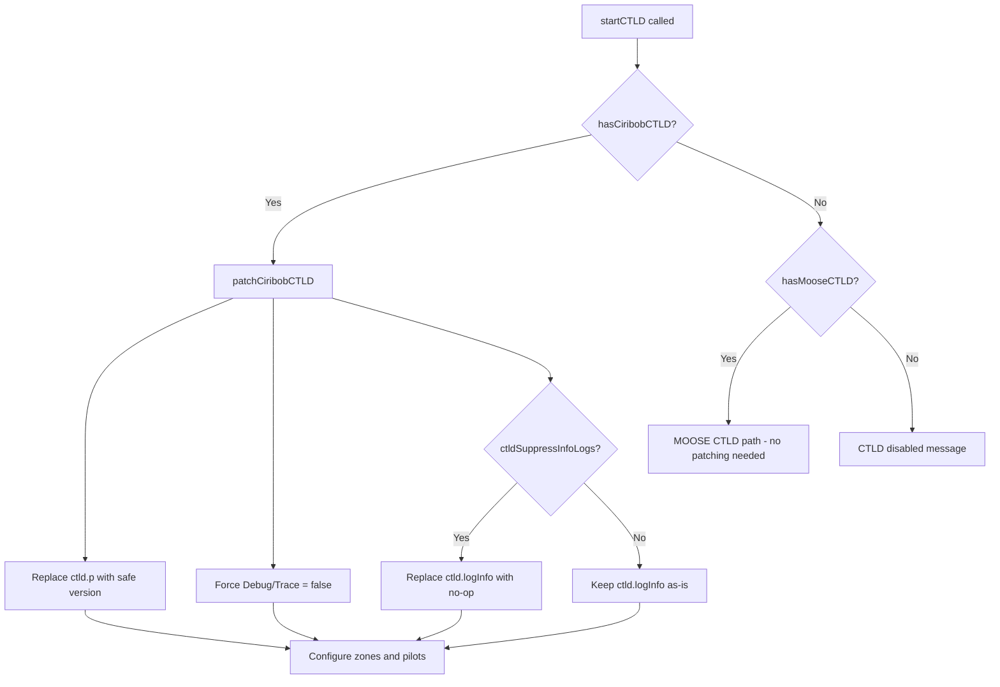

# Plan: Runtime CTLD Log Spam & Crash Fix

## Problem Summary

1. **ciribob CTLD's `ctld.p()` function** (line 2302 of CTLD.lua) recursively serializes Lua tables for logging. When it encounters deeply nested or circular-reference objects (like MOOSE GROUP objects or DCS unit objects), it hits the `MAX_LEVEL = 20` depth limit and calls `ctld.logError()`, producing the error:
   ```
   E - CTLD - p|2307: max depth reached in ctld.p : 20
   ```
   This can cause performance issues or crashes when it happens repeatedly.

2. **DCS event log spam** — The massive `event:weapon_type=...` lines in `dcs.log` come from MOOSE's event tracing system, not from CTLD or the ground ops script. This is a separate concern.

3. **The user modified their local CTLD.lua** to address these issues, but wants to know if the ground ops script can handle it at runtime instead, so they can use an unmodified CTLD.lua.

## Solution: Runtime Monkey-Patching

Since ciribob CTLD stores all its functions on the global `ctld` table, our script can safely override them after CTLD loads. This is standard Lua practice.

### What Gets Patched

#### 1. `ctld.p()` — Safe Object Serializer
Replace with a version that:
- Tracks already-visited tables using a `seen` set to detect circular references
- Returns `[circular]` instead of recursing into already-seen tables
- Respects a configurable max depth (default 10, lower than the original 20)
- Handles all the same types as the original (table, function, boolean, nil, other)

#### 2. `ctld.logInfo()` — Optional Suppression
- Add a CONFIG flag `ctldSuppressInfoLogs` (default `false`)
- When true, replace `ctld.logInfo` with a no-op to reduce log volume
- Keep error and warning logs always active

#### 3. `ctld.logDebug()` / `ctld.logTrace()` — Ensure Disabled
- These are already gated by `ctld.Debug` and `ctld.Trace` flags
- Our script will explicitly set `ctld.Debug = false` and `ctld.Trace = false` as a safety measure

### Integration Point

The patches will be applied in the existing ciribob CTLD integration path at `startCTLD()` → PATH B (line ~2386 of `bullets_ground_ops_V09B.lua`), right after detecting `hasCiribobCTLD` and before configuring zones.

### CONFIG Options

Add to the CONFIG table:
```lua
-- CTLD logging control (ciribob CTLD only)
ctldPatchLogging = true,       -- Patch ctld.p() to handle circular refs safely
ctldMaxLogDepth = 10,          -- Max table depth for ctld.p() serialization
ctldSuppressInfoLogs = false,  -- Suppress ctld.logInfo() messages
```

## Implementation Steps

### Step 1: Add CONFIG options
Add three new config entries in the CTLD section of the CONFIG table.

### Step 2: Write the patching function
Create a new local function `patchCiribobCTLD()` that:
1. Replaces `ctld.p()` with a circular-reference-safe version
2. Forces `ctld.Debug = false` and `ctld.Trace = false`
3. Optionally replaces `ctld.logInfo` with a no-op
4. Logs that patches were applied

### Step 3: Call the patch in PATH B
In the ciribob CTLD integration path, call `patchCiribobCTLD()` before zone configuration.

### Step 4: Update README
Document the new CONFIG options and explain the CTLD logging fix.

## Code Design



## Safe `ctld.p()` Replacement Design

```lua
-- Key difference from original: uses a 'seen' set to detect circular references
function ctld.p(o, level, seen)
    local maxDepth = CONFIG.ctldMaxLogDepth or 10
    level = level or 0
    seen = seen or {}
    
    if level > maxDepth then
        return "[max depth]"
    end
    
    if type(o) == "table" then
        if seen[o] then
            return "[circular]"
        end
        seen[o] = true
        local text = "\n"
        for key, value in pairs(o) do
            text = text .. string.rep(" ", level + 1)
                .. "." .. tostring(key) .. "=" .. ctld.p(value, level + 1, seen) .. "\n"
        end
        return text
    elseif type(o) == "function" then
        return "[function]"
    elseif type(o) == "boolean" then
        return o and "[true]" or "[false]"
    elseif o == nil then
        return "[nil]"
    else
        return tostring(o)
    end
end
```

## Regarding the DCS Event Log Spam

The massive `event:weapon_type=...` lines are from **MOOSE's event tracing**, not from CTLD or the ground ops script. To reduce this:
- MOOSE has a `BASE:TraceOff()` or similar mechanism
- Alternatively, `_EVENTDISPATCHER` settings can be adjusted
- This is a separate issue from the CTLD fix and can be addressed independently

## Files Modified

| File | Change |
|------|--------|
| `scripts/bullets_ground_ops_V09B.lua` | Add CONFIG options, add `patchCiribobCTLD()` function, call it in PATH B |
| `README.md` | Document new CONFIG options |

## Verification

1. Load mission with **unmodified** ciribob CTLD.lua
2. Verify no `max depth reached in ctld.p` errors in dcs.log
3. Verify CTLD F10 menu appears for helicopter pilots
4. Verify troop loading/unloading works normally
5. Check dcs.log for `[MZ-INIT] Patched ciribob CTLD logging` confirmation message
