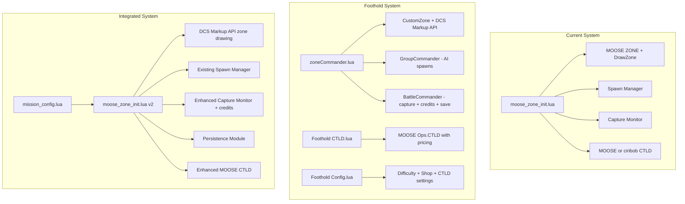

# Foothold Feature Integration Plan

## Overview

Cherry-pick features from Leka's Foothold into the existing `moose_zone_init.lua` framework, keeping the 5-zone Alpha–Echo structure and existing spawn/capture logic while adding:

1. **DCS Markup API zone coloring** (Foothold's approach — more reliable than MOOSE DrawZone)
2. **Persistence / save-load system** (survive server restarts)
3. **Player credit / contribution system** (earn credits for kills, spend on shop items)
4. **Enhanced CTLD** (Foothold's MOOSE Ops.CTLD pattern with richer cargo definitions)

---

## Architecture Comparison



---

## Feature 1: DCS Markup API Zone Coloring

### What Foothold Does
- Uses `trigger.action.circleToAll()` to draw zone circles with a unique markup ID per zone
- Uses `trigger.action.setMarkupColor()` and `trigger.action.setMarkupColorFill()` to change colors on capture
- Uses `trigger.action.textToAll()` for zone labels with `trigger.action.setMarkupText()` for updates
- Each zone gets a unique index: `zone.index = bc:getZoneIndexByName(zone.zone) + 3000`
- Text labels use `2000 + zone.index` as their markup ID

### What We Port
- Replace `safeDrawZone()` and `redrawZoneColor()` with DCS native markup API calls
- Add zone label text that updates on capture
- Color scheme from Foothold:
  - **RED**: line/fill `{1, 0, 0, 0.3}`, text `{0.7, 0, 0, 0.8}`
  - **BLUE**: line/fill `{0, 0, 1, 0.3}`, text `{0, 0, 0.7, 0.8}`
  - **Neutral**: line/fill `{0.7, 0.7, 0.7, 0.3}`, text `{0.3, 0.3, 0.3, 1}`

### Changes Required
- New function `drawZoneMarkup(zoneName, index, color)` using `trigger.action.circleToAll()`
- New function `updateZoneMarkup(index, newColor, newTextColor)` using `setMarkupColor/setMarkupColorFill`
- New function `updateZoneLabel(index, text, textColor)` using `setMarkupText`
- Assign each zone a stable markup ID (e.g., `3000 + zoneIndex` for circle, `5000 + zoneIndex` for label)
- Remove dependency on MOOSE `DrawZone` / `UndrawZone`

---

## Feature 2: Persistence / Save-Load System

### What Foothold Does
- `Utils.saveTable(filename, variablename, data)` — serializes a Lua table to a file in `lfs.writedir() .. "Missions/Saves/"`
- `Utils.loadTable(filename)` — loads and executes the saved Lua file via `loadfile()`
- `BattleCommander:saveToDisk()` — called periodically via SCHEDULER, saves zone states
- `BattleCommander:loadFromDisk()` — called at init, restores zone ownership + upgrades
- State table includes: zone sides, built upgrades, player credits, rank data

### What We Port
- Lightweight `saveState()` / `loadState()` functions
- Save file at `lfs.writedir() .. "Missions/Saves/mz_state.lua"`
- State data:
  - `blueCaptured` / `redCaptured` tables
  - `playerCredits` table
  - `activeHub` / `RED.active` spawn hub positions
  - Timestamp of last save
- Auto-save every N seconds via SCHEDULER
- Load on init (before capture monitor starts)

### Changes Required
- New `serializeValue()` function (port from Foothold Utils)
- New `saveState()` function
- New `loadState()` function
- Add `CONFIG.enablePersistence = true`
- Add `CONFIG.saveInterval = 60` (seconds)
- Add `CONFIG.saveFile = "mz_state.lua"`
- Call `loadState()` during initialization
- Add periodic `saveState()` via SCHEDULER

---

## Feature 3: Player Credit / Contribution System

### What Foothold Does
- `BattleCommander:addContribution(playerName, side, amount)` — adds credits
- `BattleCommander:startRewardPlayerContribution(defaultReward, rewards)` — hooks DCS events
- Tracks kills by category: airplane, helicopter, ground, ship, SAM, infantry, structure
- Different reward amounts per kill type (configurable in `RewardContribution`)
- Credits can be spent via F10 radio menu (shop system)
- Zone capture/upgrade rewards
- Flight time rewards

### What We Port (Simplified)
- `playerCredits[playerName]` table tracking earned credits
- Event handler for kills awarding credits by target type
- Zone capture bonus credits
- F10 menu to check balance
- Basic shop: spend credits on reinforcement waves, smoke markers, or CTLD items
- No ranking system initially (can add later)

### Changes Required
- New `CONFIG.enableCredits = true`
- New `CONFIG.rewards` table (kill type -> credit amount)
- New `CONFIG.shopPrices` table
- New event handler function `onKillEvent(event)` 
- New `addCredits(playerName, amount)` / `getCredits(playerName)` / `spendCredits(playerName, amount)`
- F10 menu builder for shop
- Hook into capture monitor for capture bonuses

---

## Feature 4: Enhanced CTLD

### What Foothold Does
- Uses MOOSE `CTLD:New()` with extensive helicopter prefix list
- Configurable per-airframe capabilities via `CTLDUnitCapabilities`
- Rich cargo definitions: troops, crates, engineers, FARPs
- CTLD pricing tied to credit system
- Subcategory menus (`usesubcats = true`)
- Fixed-wing support (C-130 paradrop)
- Sling loading
- Door opening requirement

### What We Port
- Expand current CTLD cargo definitions to match Foothold variety
- Add per-airframe capability configuration
- Tie CTLD item costs to credit system (if credits enabled)
- Add more troop/vehicle templates
- Add FARP deployment capability

### Changes Required
- Expand `CONFIG.ctldTroops` with more squad types
- Add `CONFIG.ctldUnitCapabilities` table (per-airframe limits)
- Add FARP crate definition
- If credits enabled, check balance before CTLD load/build
- Add more helicopter prefixes to `CONFIG.ctldHeloPrefixes`

---

## Implementation Order

1. **DCS Markup API zone coloring** — Most visible improvement, replaces the fix we just made
2. **Persistence** — Critical for multiplayer servers
3. **Credit system** — Adds gameplay depth
4. **Enhanced CTLD** — Expands logistics options

---

## File Structure After Integration

```
DCS-CTLD-1.6.1/
├── moose_zone_init.lua      # Main script (enhanced with ported features)
├── mz_persistence.lua       # Save/load module (extracted for clarity)
├── mz_credits.lua           # Credit/shop module (extracted for clarity)  
├── CTLD.lua                 # ciribob CTLD (unchanged, fallback)
├── CTLD-i18n.lua            # ciribob i18n (unchanged)
├── mist.lua                 # MIST (unchanged)
├── moose_zone_diag.lua      # Diagnostics (unchanged)
└── README.md                # Updated documentation
```

**Alternative**: Keep everything in `moose_zone_init.lua` as a single file (simpler load order in ME) with clearly separated sections.

---

## Risk Assessment

| Risk | Mitigation |
|------|-----------|
| DCS markup API not available in all DCS versions | Fallback to MOOSE DrawZone if `trigger.action.circleToAll` is nil |
| `lfs` / `io` not available in multiplayer sanitized env | Guard all file ops with `if lfs and io then`; disable persistence gracefully |
| Credit system exploits | Cap max credits, validate kill events, cooldown on shop purchases |
| CTLD conflicts between MOOSE and ciribob versions | Detect which is loaded (already done), only use one |
| Large single-file complexity | Use clear section headers and consider splitting into modules |

---

## Questions to Resolve Before Implementation

1. **Single file vs. modules?** — Keep everything in `moose_zone_init.lua` or split into separate files?
2. **Shop items** — What should players be able to buy? (reinforcement waves, smoke, CTLD items, etc.)
3. **Credit amounts** — Use Foothold defaults or customize?
4. **CTLD templates** — Which late-activated ME groups do you have set up? (determines what cargo we can define)
